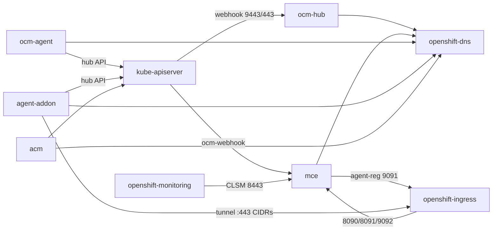

# Server Foundation Network Policies

Inventory of SF workloads, ports, and NetworkPolicies for enablement and QE validation.

**Defaults (5.0+):** `MCE.spec.networkPolicies.enabled` and `MCH.spec.networkPolicies.enabled` are `true`. MCE uses create-once (create if missing; do not overwrite; delete when disabled). SF policies select **pods only** — they do not lock down shared namespaces (§4).

```bash
oc patch multiclusterengine multiclusterengine --type=merge \
  -p '{"spec":{"networkPolicies":{"enabled":true}}}'
oc patch multiclusterhub multiclusterhub -n open-cluster-management --type=merge \
  -p '{"spec":{"networkPolicies":{"enabled":true}}}'
```

---

## 1. Common allow categories

Deny-by-default, then allow:

| Category | Dir | Peers / ports |
|----------|-----|---------------|
| DNS | Egress | `:53`, `:5353` (often port-only in shipped NPs) |
| API | Egress | `:443`, `:6443` |
| Webhooks | Ingress | kube-apiserver → webhook port (`:9443` or `:8000`) |
| Metrics | Ingress | monitoring → component metrics port |
| Same-ns peers | Both | Explicit `podSelector` only |
| Proxy tunnel (hub) | Ingress | Router / empty-from → ANP `:8090`/`:8091`, user `:9092` |
| Proxy tunnel (spoke) | Egress | TCP `:443` to hub ingress CIDRs (Route is not an NP peer) |
| Spoke → hub API | Egress | Hub kubeconfig `:443`/`:6443` |

---

## 2. Workloads and ports

| Scope | Namespace(s) | Selector(s) | Key ports |
|-------|--------------|-------------|-----------|
| OCM hub controllers / webhooks | `open-cluster-management-hub` | `app=clustermanager-*`, `app=cluster-manager-*-webhook` | webhook **9443**; healthz **8443**; optional gRPC **8090** |
| registration-operator | `multicluster-engine` | `app=cluster-manager` | API/DNS egress |
| Klusterlet / agents | `open-cluster-management-agent` | `app=klusterlet`, `app=klusterlet-agent` (+ optional split agents); tls-profile-sync sidecar | hub + spoke API/DNS |
| MIC | `multicluster-engine` | `app=managedcluster-import-controller-v2` | agent-reg **9091**; metrics **8383** |
| ocm-controller | `multicluster-engine` | `control-plane=ocm-controller` | health **8000** (local) |
| ocm-webhook | `multicluster-engine` | `control-plane=ocm-webhook` | **8000** (Svc 443→8000) |
| ocm-proxyserver | `multicluster-engine` | `control-plane=ocm-proxyserver` | secure **6443**; → user-server **9092** |
| foundation agent | `open-cluster-management-agent-addon` | `component=work-manager` | listen **4443** |
| CLSM | `multicluster-engine` | `app=clusterlifecycle-state-metrics-v2` | HTTPS metrics **8443**; health **8081** |
| ANP proxy-server | `multicluster-engine` | `proxy.open-cluster-management.io/component-name=proxy-server` | **8090** / **8091** |
| cluster-proxy manager | `multicluster-engine` | `component=cluster-proxy-addon-manager` | API/DNS |
| cluster-proxy user | `multicluster-engine` | `component=cluster-proxy-addon-user` | **9092** (+ ANP client **8090**) |
| proxy-agent | `open-cluster-management-agent-addon` | `proxy.open-cluster-management.io/component-name=proxy-agent` | egress hub `:443` CIDRs |
| MSA agent | `open-cluster-management-agent-addon` | `addon-agent=managed-serviceaccount` | health **8000**; metrics **38080** (no hub MSA manager Deployment) |
| cluster-permission | `multicluster-engine` | `name=cluster-permission` | metrics **8286** |
| KAC | `open-cluster-management` | `app=klusterlet-addon-controller-v2` | metrics **8383** |
| MRA (optional) | ACM ns | chart labels | health **8081**; metrics optional |

**Optional / often absent:** hub `work-controller`, gRPC server, PlacementDebugServer, MRA, hosted-mode webhook NodePorts (**30443** / **31443**).

---

## 3. Traffic map



---

## 4. Shared namespaces (out of scope)

Do **not** use namespace-wide `podSelector: {}` for SF. Other owners share these namespaces (Hive, console, GRC, search, policy addons, etc.). SF NPs target SF pod labels only.

---

## 5. Shipped NetworkPolicies

| Policy name | Side | `podSelector` | Source | Ingress | Egress |
|-------------|------|---------------|--------|---------|--------|
| `managedcluster-import-controller-network-policy` | Hub | `app=managedcluster-import-controller-v2` | backplane `server-foundation` | router → `:9091`; `:8383` | DNS; API |
| `ocm-controller-network-policy` | Hub | `control-plane=ocm-controller` | same | — | DNS; API |
| `ocm-webhook-network-policy` | Hub | `control-plane=ocm-webhook` | same | `:8000` | DNS; API |
| `ocm-proxyserver-network-policy` | Hub (OCP) | `control-plane=ocm-proxyserver` | same | `:6443` | DNS; API; user `:9092` |
| `work-manager-addon-agent-network-policy` | Spoke | `component=work-manager` | foundation addon chart (`--enable-network-policies`) | `:4443` | DNS; API |
| `clusterlifecycle-state-metrics-network-policy` | Hub | `app=clusterlifecycle-state-metrics-v2` | backplane `cluster-lifecycle` | monitoring → `:8443` | DNS; API |
| `cluster-proxy-addon-manager-network-policy` | Hub | `component=cluster-proxy-addon-manager` | backplane `cluster-proxy-addon` | — | DNS; API |
| `cluster-proxy-addon-user-network-policy` | Hub | `component=cluster-proxy-addon-user` | same (`enableServiceProxy`) | `:9092` | DNS; API; proxy-server `:8090` |
| `cluster-proxy-proxy-server-network-policy` | Hub | `…component-name=proxy-server` | same | `:8090`/`:8091`; user → `:8090` | DNS; API |
| proxy-agent NP | Spoke | `…component-name=proxy-agent` | cluster-proxy addon-agent (`--enable-network-policies`) | (chart) | DNS; API; hub `:443` |
| `managed-serviceaccount-addon-agent-network-policy` | Spoke | `addon-agent=managed-serviceaccount` | MSA AddOnTemplate | `:8000`; `:38080` | DNS; API |
| `cluster-permission-network-policy` | Hub | `name=cluster-permission` | backplane `cluster-permission` | `:8286` | DNS; API |
| `klusterlet-addon-controller-network-policy` | Hub | `app=klusterlet-addon-controller-v2` | MCH `cluster-lifecycle` | `:8383` | DNS; API |

**OCM ClusterManager / Klusterlet** NPs live in OCM (hub + agent namespaces), not the backplane SF charts — validate separately when present in the build.

**Notes:** Most chart NPs use port-only API/DNS peers. Spoke NPs need images that include ManifestWork/AddOnTemplate content. Create-once: delete NP (or toggle the feature) to pick up chart updates.

---

## 6. Validation

With NPs enabled on hub + spoke:

- [ ] Expected policies exist in MCE target ns, ACM ns, and spoke `open-cluster-management-agent-addon`
- [ ] Import / agent-registration (`:9091`) works
- [ ] ocm-webhook admits as expected
- [ ] ocm-proxyserver + cluster-proxy user path works when enabled
- [ ] Cluster-proxy tunnel healthy (hub `:8090`/`:8091`/`:9092`, spoke agent)
- [ ] cluster-permission, KAC, CLSM scrape, MSA agent still function
- [ ] Controllers Ready (API/DNS not blocked)
- [ ] Optional: denied same-ns peer cannot reach SF ports; disabling NPs removes installer-owned policies

```bash
MCE_NS=$(oc get multiclusterengine -o jsonpath='{.items[0].spec.targetNamespace}')
ACM_NS=open-cluster-management

oc get multiclusterengine -o jsonpath='{range .items[*]}{.metadata.name}{" np="}{.spec.networkPolicies.enabled}{"\n"}{end}'
oc get networkpolicy -n "$MCE_NS"
oc get networkpolicy -n "$ACM_NS" | grep klusterlet-addon || true
# on spoke:
oc get networkpolicy -n open-cluster-management-agent-addon
```

---

## 7. Port cheat sheet

| Port | Use |
|------|-----|
| 53 / 5353 | DNS |
| 443 / 6443 | API / Route / proxyserver |
| 8000 | health; ocm-webhook |
| 8080 / 8081 | CLSM HTTP / health; MRA health |
| 8090 / 8091 | ANP |
| 8286 | cluster-permission metrics |
| 8383 | MIC / KAC metrics |
| 8443 | healthz; CLSM HTTPS metrics |
| 9091 | agent-registration |
| 9092 | cluster-proxy user; ocm-proxyserver proxy-service |
| 9443 | OCM webhooks |
| 4443 | foundation agent |
| 38080 / 38081 | MSA metrics / health |
